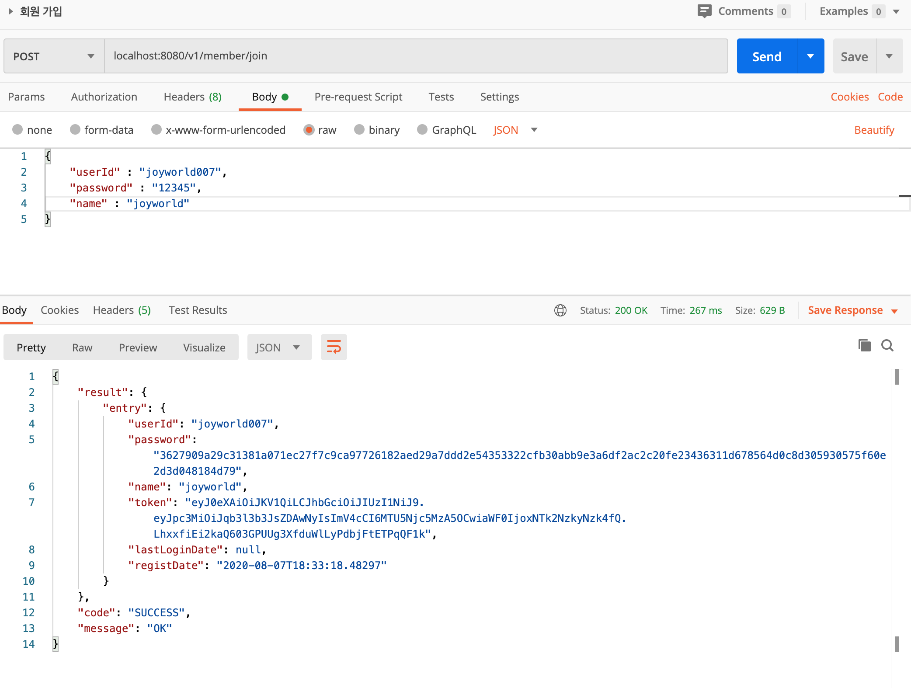
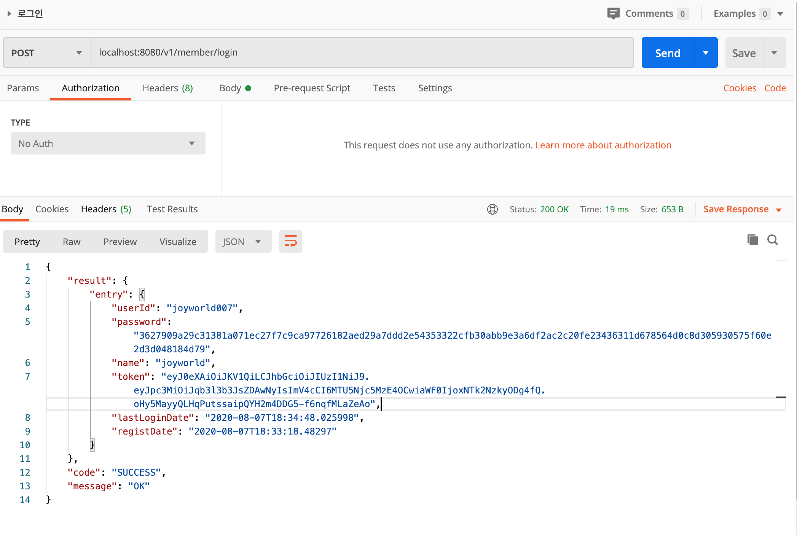
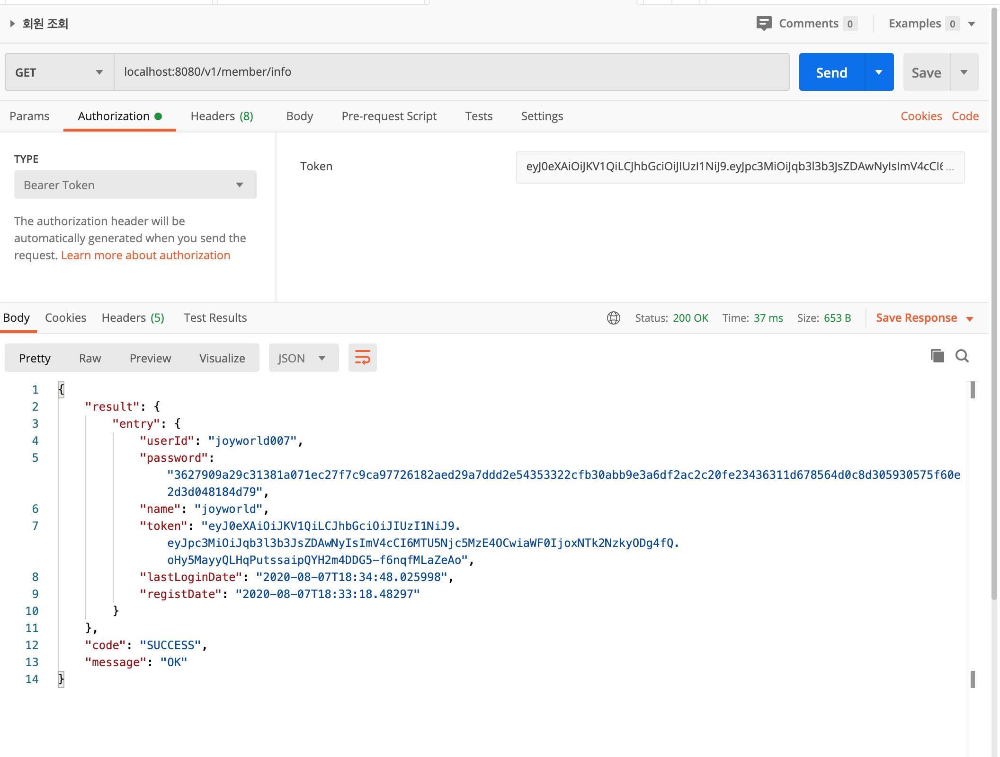

## 회원 가입, 로그인 서비스 

## Contents
* [Specifications](#chapter-1)
* [Requirement](#chapter-2) 
* [Strategy](#chapter-3)
* [Domain](#chapter-4)
* [Explanation of REST](#chapter-5)
* [Api Feature list](#chapter-6)
* [Api Endpoint](#chapter-7)
* [How to run](#chapter-8)
* [How to test](#chapter-9)

### <a name="chapter-1"></a>Specifications 
````
 OpenJDK11
 Spring Boot 2.3.1.RELEASE
 Spring Data Jpa
 JWT Token
 Spring Interceptor
 Swagger2
````
### <a name="chapter-2"></a>Requirement 
````
회원 REST API 
- JWT 웹 토큰을 이용한 회원가입, 로그인, API 인증 구현
- 회원가입 구현 ( 패스워드 안전한 방법으로 저장 )
- 회원가입, 로그인 API 구현   
- 회원 정보 API 호출 시 발급 받은 Token을 이용해 인증처리 
- 회원 정보 조회 API 개발 
````

### <a name="chapter-3"></a>Strategy 
```` 
- 회원가입 구현 ( 패스워드 SHA-512 단방향 암호화 하여 저장 )
- API 호출 시 token 값 유효성 여부 검증 하는 Interceptor 구현
- 로그인 구현 ( 로그인 후 JWT 토큰 제공 )
- 회원 정보 조회 ( 제공 받은 JWT Token을 이용하여 API 호출 )   
````

### <a name="chapter-4"></a>Domain 
```
유저(User)
   유저아이디
   패스워드
   사용자이름
   토큰
   최근접속일자
   가입일자
```

### <a name="chapter-5"></a>Explanation of REST 
|HTTP Method|Usage|
|:---|:---|
|GET   |Receive a read-only data      |
|PUT   |Overwrite an existing resource|
|POST  |Creates a new resource        |
|DELETE|Deletes the given resource    |

### <a name="chapter-6"></a>Api Feature list 
```
- 회원가입
- 로그인
- 회원 정보 조회
``` 

### <a name="chapter-7"></a>Api Endpoint
```
API 실행 && 테스트 절차
1. 회원가입을 합니다 
2. 로그인 후 인증 토큰을 받습니다
3. Header userId, Authorization Header Bearer Token 값을 넣고 회원 정보 조회 API를 호출합니다

EndPoint : /v1/member/join
Method : POST 
Description : 회원가입
Return value: HTTP status 201 (Created) 
Payload Example (required parameters)
{
    "userId" : "joyworld007", 
    "password" : "12345",
    "name" : "joyworld"
}

----------------------------------------------------------------------------------------------------

EndPoint : /v1/member/login
Method : POST
Description : 로그인
Return value: HTTP status 200 (OK), Http status 404(NOT FOUNT) 
Payload Example (required parameters)
{
	"userId" : "joyworld007", 
	"password" : "12345"
}
----------------------------------------------------------------------------------------------------

EndPoint : /v1/member/info
Method : PUT 
Description : 회원 정보를 조회
Request Header
{
    userId : userId 
    Authorization Header Bearer Token : Access Token
}               
Return value: HTTP status 200 (OK), 401 (Unauthorized)

```
### <a name="chapter-8"></a>How to Run
```
1. 실행
./gradlew bootrun

2. Test 
./gradlew test
./gradlew jacocoTestReport

3. Swagger URI
http://localhost:8080/swagger-ui.html
```
 
### <a name="chapter-9"></a>How to Test
1. Spring Boot Application을 실행 합니다. 

2. 회원 가입 API를 호출하여 회원 가입을 진행 합니다.


3. 로그인 API를 호출하여 Access Token을 획득 합니다.


4. Access Token을 이용하여 회원 정보 조회 API를 호출하여 회원 정보를 조회 합니다.

